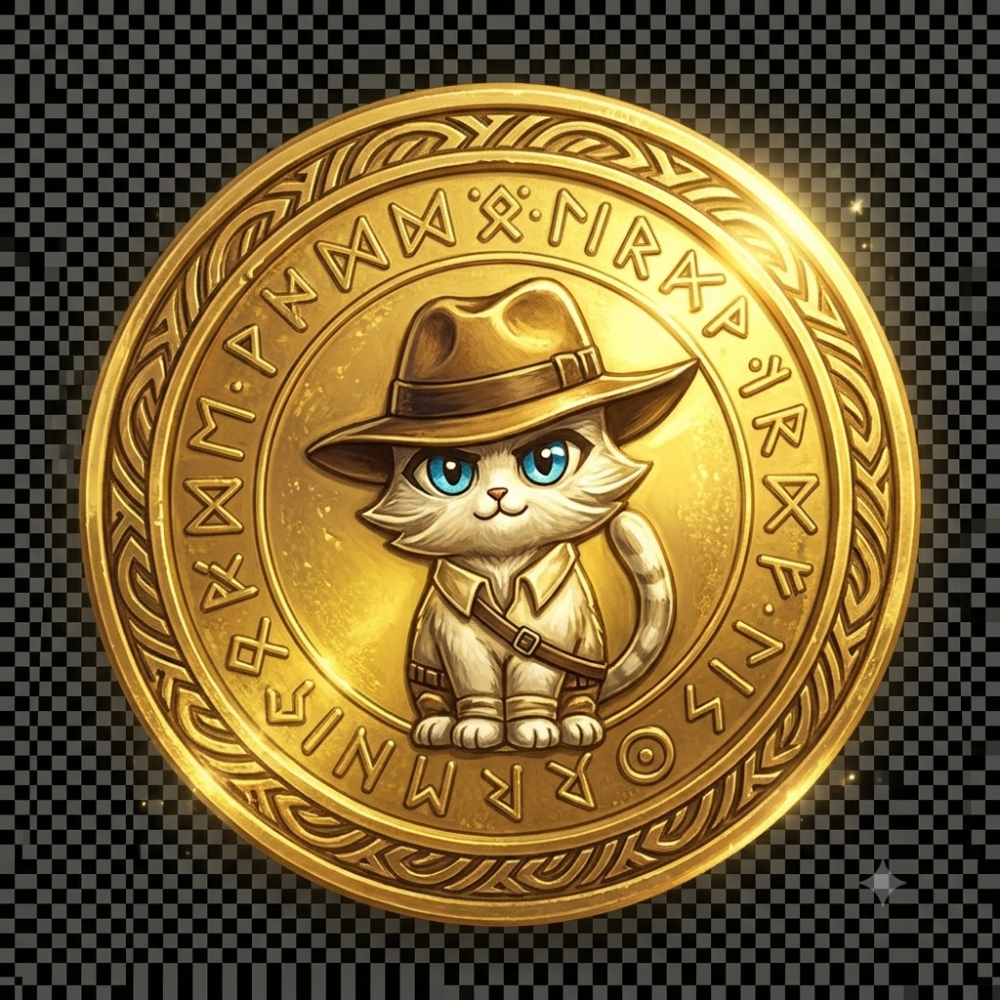

# 🗺️ Cambios en Mapa y Ruleta

## ✅ Cambios Realizados

### 1. **Camino de Líneas Amarillas Actualizado**

El camino visual (líneas amarillas punteadas) ahora sigue correctamente el recorrido:

```
Inicio (88%, 18%) 
  ↓ 
Dado (84%, 52%) ← NUEVA POSICIÓN
  ↓
Cajas (65%, 72%)
  ↓
Bolsa (48%, 38%)
  ↓
Ruleta (32%, 75%)
  ↓
Tesoro (15%, 50%)
```

**Cambio principal:**
- Las líneas ahora conectan correctamente **Inicio → Dado** en la nueva posición
- El camino completo está trazado con curvas suaves (Bézier)

---

### 2. **Ruleta con Objetos Reales**

Se agregaron **8 objetos reales** dentro de la ruleta vacía:

#### Distribución de objetos (8 sectores):
1. **Top (0°):** Moneda dorada 🪙
2. **Top-Right (45°):** Llave antigua 🗝️
3. **Right (90°):** Moneda dorada 🪙
4. **Bottom-Right (135°):** Pergamino 📜
5. **Bottom (180°):** Moneda dorada 🪙
6. **Bottom-Left (225°):** Piedra gris 🪨
7. **Left (270°):** Llave antigua 🗝️
8. **Top-Left (315°):** Pergamino 📜

#### Imágenes utilizadas:
- ✅ `img/objetos/moneda-dorada.png` (3 veces - mayor probabilidad)
- ✅ `img/objetos/llave-antigua.png` (2 veces)
- ✅ `img/objetos/pergamino-pista.png` (2 veces)
- ✅ `img/objetos/piedra-gris.png` (1 vez - menor probabilidad)

---

## 🎨 Detalles Técnicos

### HTML - Objetos en la Ruleta
```html
<div class="ruleta-objetos">
  <!-- 8 objetos posicionados en círculo -->
  
  <!-- ... más objetos ... -->
</div>
```

### CSS - Estilos de Objetos
```css
.ruleta-objetos {
  position: absolute;
  inset: 0;
  pointer-events: none; /* No interfieren con el clic */
}

.obj-ruleta {
  position: absolute;
  width: 50px;
  height: 50px;
  filter: drop-shadow(...);
}
```

---

## 🎯 Funcionamiento

### Ruleta:
1. Los objetos están **posicionados en círculo** dentro de la ruleta
2. Al girar, **toda la ruleta gira** incluyendo los objetos
3. El sistema de probabilidades **sigue funcionando igual**:
   - 40% Moneda (3 sectores)
   - 25% Llave (2 sectores)
   - 20% Pergamino (2 sectores)
   - 15% Piedra (1 sector)

4. La **flecha apunta arriba** (0°)
5. El resultado depende de **qué objeto queda bajo la flecha**

### Mapa:
1. Las líneas amarillas ahora **siguen el camino correcto**
2. Conectan todos los puntos en orden
3. Animación de líneas punteadas en movimiento

---

## 📱 Responsive

Los objetos de la ruleta **se adaptan automáticamente** al tamaño del disco:
- Desktop: Objetos 40-50px
- Mobile: Se escalan proporcionalmente

---

## 🧪 Para Probar

1. **Abre el juego**
2. Ve al **Mapa de exploración**
   - ✅ Verifica que las líneas amarillas conecten Inicio → Dado → Cajas → etc.
3. Completa las misiones hasta llegar a la **Ruleta**
4. En la Ruleta:
   - ✅ Verifica que veas 8 objetos distribuidos en círculo
   - ✅ Gira la ruleta
   - ✅ Los objetos deben girar con la ruleta
   - ✅ El premio debe coincidir con el objeto bajo la flecha

---

## 📝 Archivos Modificados

1. **index.html**
   - Camino SVG actualizado (líneas de Inicio a Dado)
   - Objetos agregados dentro de `.ruleta-disco`

2. **style.css**
   - Estilos para `.ruleta-objetos`
   - Estilos para `.obj-ruleta` (tamaños y efectos)

3. **script.js**
   - Posiciones del mapa ya estaban actualizadas
   - Lógica de la ruleta sigue funcionando igual

---

## 🎨 Resultado Visual

### Antes:
- ❌ Líneas no conectaban Inicio → Dado correctamente
- ❌ Ruleta vacía sin objetos visibles

### Ahora:
- ✅ Camino completo visible de Inicio a Tesoro
- ✅ Ruleta con 8 objetos reales distribuidos
- ✅ Visual más atractivo y claro
- ✅ Los objetos giran con la ruleta

---

## 💡 Nota Importante

Los objetos están **distribuidos uniformemente en 8 sectores** de 45° cada uno:
- 0° (arriba), 45°, 90°, 135°, 180°, 225°, 270°, 315°

Esto coincide con la lógica del JavaScript que ya estaba implementada en `RULETA_CONFIG.sectores`.

---

**¡Ahora el mapa y la ruleta se ven mucho mejor y más profesionales!** 🎲🎰✨
